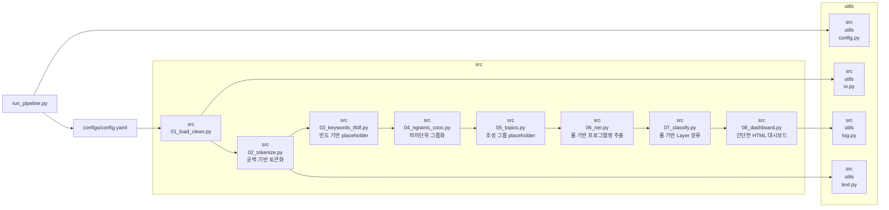

# 키워드 분석 프로젝트
> 텍스트 데이터셋을 실행(run) 단위로 관리하고, 키워드·토픽·엔터티를 분석해 HTML 대시보드로 출력하는 파이프라인
---

## 📌 목차
- [0) TL;DR](#0-tldr)
- [1) 주요 기능](#1-주요-기능)
- [2) 폴더 구조](#2-폴더-구조)
- [3) 빠른 실행 방법](#3-빠른-실행-방법)
- [4) 설정파일](#4-설정파일)
- [5) 파이프라인 단계](#5-파이프라인-단계--현재-vs-미구현)
- [6) 출력물](#6-출력물)
- [7) 요구 사항](#7-요구-사항)
- [8) 로드맵](#8-로드맵)
- [9) 라이선스](#9-라이선스)

---

## 0) TL;DR
- 🗂️ **유연한 데이터셋 관리**: `data/raw/{dataset_id}/`에 snapshot 저장 (기본값: `latest`)
- 📂 **실행(run) 단위 출력**: 실행 시마다 `*/{run_id}`에 결과 저장 (`{dataset_id}_{YYYYMMDDHHMMSS}`)
- ⚙️ **현재 상태**: 파이프라인은 end-to-end 실행 가능. 일부 단계는 **placeholder 로직**으로 구현 → 추후 업그레이드 예정

---

## 1) 주요 기능
-  Dataset / 버전 관리 (`latest` 또는 `--dataset_id` 지정 가능)
-  8단계 파이프라인 (로드 → 토큰화 → 키워드 → 공동출현 → 토픽 → NER → 분류 → 대시보드)
-  실행(run) 단위별 재현 가능한 출력
-  업그레이드 예정: 한국어 형태소 분석기, TF-IDF, LDA/BERTopic, spaCy NER, ML 분류기, Plotly 대시보드


---

## 2) 폴더 구조

```markdown
keyword_analysis_project/
├─ configs/
│  └─ config.yaml              # 파이프라인 설정
├─ data/
│  ├─ raw/                     # 원본 데이터셋 스냅샷
│  │  └─ filtered_blog2.json
│  ├─ interim/                 # 중간 산출물 (run_id 단위)
│  │  └─ {run_id}/
│  │     ├─ cleaned.csv
│  │     └─ tokens.csv
│  └─ processed/               # 최종 가공 산출물 (run_id 단위)
│     └─ {run_id}/
│        ├─ keywords_top.csv
│        ├─ ngrams_edges.csv
│        ├─ topics.json
│        ├─ entities.csv
│        └─ layer_tags.csv
├─ dicts/
│  ├─ stopwords.txt
│  ├─ synonyms.csv
│  ├─ program_list.csv
│  ├─ layer_rules.yml
│  └─ persona_rules.yml
├─ logs/
│  └─ *.log
├─ outputs/
│  ├─ runs/
│  │  └─ {run_id}/dashboard/
│  │     └─ dash.html
│  └─ latest_run.json          # 최근 실행 포인터
src/
├─ 01_load_clean.py
├─ 02_tokenize.py              # 현재: 공백 기반 토큰화
│   └─ 02_tokenize_korean.py   # planned: 형태소 분석기 기반
├─ 03_keywords_tfidf.py        # 현재: 빈도 기반 placeholder
│   └─ 03_keywords_tfidf_true.py   # planned: 실제 TF-IDF
├─ 04_ngrams_cooc.py           # 의미단위 그룹화
├─ 05_topics.py                # 현재: 초성 그룹 placeholder
│   ├─ 05_topics_lda.py        # planned: LDA
│   └─ 05_topics_bertopic.py   # planned: BERTopic
├─ 06_ner.py                   # 현재: 룰 기반 프로그램명 추출
│   └─ 06_ner_spacy_ko.py      # planned: spaCy KoELECTRA 기반
├─ 07_classify.py              # 현재: 룰 기반 Layer 분류
│   └─ 07_classify_ml.py       # planned: ML 기반 classifier
├─ 08_dashboard.py             # 현재: 간단한 HTML 대시보드
│   └─ 08_dashboard_plotly.py  # planned: Plotly 인터랙티브
├─ utils/
│   ├─ config.py
│   ├─ io.py
│   ├─ log.py
│   └─ text.py
├─ notebooks/
│  └─ EDA.ipynb                 # (planned)
├─ requirements.txt
├─ run_pipeline.py
└─ README.md
```


### 📂 파일별 역할 설명

| **파일** | **기능 설명** |
|----------|----------------|
| run_pipeline.py | 파이프라인 전체 실행 시작점. `configs/config.yaml`을 읽어 dataset_id, run_id, 출력 경로 등을 설정하고, 단계별 스크립트(01~08)를 순차 실행하는 오케스트레이터 역할. |
| src/01_load_clean.py | 원본 JSON 데이터를 불러와 클리닝(HTML 태그 제거, 특수문자/공백 정리 등) 후 `cleaned.csv`를 생성. |
| src/02_tokenize.py | 현재 버전은 단순 공백 기반 토큰화. stopwords(`dicts/stopwords.txt`) 제거와 synonyms(`dicts/synonyms.csv`) 치환을 적용. 결과는 `tokens.csv`. |
| src/03_keywords_tfidf.py | 현재는 빈도 기반 placeholder로 키워드 상위 n개를 산출. 결과는 `keywords_top.csv`. 향후 TF-IDF 기반으로 확장 예정. |
| src/04_ngrams_cooc.py | 토큰 리스트에서 n-gram과 공동출현(co-occurrence) 관계를 계산. 결과는 `ngrams_edges.csv` (네트워크 분석용 엣지 리스트). |
| src/05_topics.py | 현재는 단순 placeholder (예: 초성 그룹화). 결과는 `topics.json`. 향후 LDA/BERTopic으로 교체 예정. |
| src/06_ner.py | 룰 기반 NER(개체명인식, Named Entity Recognition). `dicts/program_list.csv`에 정의된 프로그램명을 텍스트에서 추출하여 `entities.csv` 생성. |
| src/07_classify.py | 페르소나 룰 기반 문서 분류. `dicts/layer_rules.yml`, `dicts/persona_rules.yml` 규칙을 이용해 `layer_tags.csv` 생성. |
| src/08_dashboard.py | 분석 결과를 간단한 정적 HTML 대시보드(`dash.html`)로 출력. 향후 Plotly 기반 인터랙티브 버전으로 확장 예정. |
| src/utils/config.py | `configs/config.yaml`을 불러와 dataset_id, run_id, 경로 등을 관리하는 설정 유틸리티. |
| src/utils/io.py | CSV/JSON 입출력 담당. interim/processed 디렉토리에 데이터를 저장하고 불러오는 기능. |
| src/utils/log.py | 실행 로그 관리. `logs/*.log` 파일로 기록해 디버깅 및 추적 지원. |
| src/utils/text.py | 텍스트 처리 유틸리티. 정규표현식 기반 클리닝, 문자열 정규화, 토큰 후처리 등을 제공. |


---

## 3) 빠른 실행 방법
```bash
python -m venv .venv
source .venv/bin/activate   # Windows: .venv\Scripts\activate
pip install -r requirements.txt

# 최신 dataset으로 실행
python run_pipeline.py

# 특정 dataset snapshot 지정
python run_pipeline.py --dataset_id 2025-09-23_1000
````

---

## 4) 설정파일 (configs/config.yaml)

```
configs/config.yaml
- dataset.mode: `None`
- dataset.id: `None`
- dataset.raw_root: `None` (glob: `None`)
- run.run_id: `None` (자동: `{dataset_id}_{YYYYMMDDHHMMSS}`)
- outputs_root: `None`
- interim_root: `None`, processed_root: `None`
```

---

## 5) 파이프라인 단계 — 현재 vs 미구현

| 단계 파일                 | 상태 / 설명             |
| --------------------- | ------------------- |
| `src/08_dashboard.py` | 정적 HTML 대시보드 (stub) |

### 🚧 계획은 되었으나 미구현된 파일

* src/02\_tokenize\_korean.py
* src/03\_keywords\_tfidf\_true.py
* src/05\_topics\_lda.py
* src/05\_topics\_bertopic.py
* src/06\_ner\_spacy\_ko.py
* src/07\_classify\_ml.py
* src/08\_dashboard\_plotly.py
* notebooks/EDA.ipynb

---

## 6) 출력물

* `data/interim/{run_id}/cleaned.csv`, `tokens.csv`
* `data/processed/{run_id}/keywords_top.csv`, `ngrams_edges.csv`, `topics.json`, `entities.csv`, `layer_tags.csv`
* `outputs/runs/{run_id}/dashboard/dash.html`
* `outputs/latest_run.json`

---

## 7) 요구 사항 (요약)

* pandas, numpy, PyYAML, tqdm, scikit-learn, networkx, matplotlib, plotly

---

## 8) 로드맵

* 🔤 토큰화 → `kiwipiepy` / `OKT` 적용 (품사 필터링, 복합명사 처리)
* 🗝️ 키워드 → TF-IDF (scikit-learn)
* 📑 토픽 → LDA + coherence / BERTopic (다국어 지원)
* 🧩 NER → spaCy Ko/KoELECTRA 기반
* 🏷️ 분류기 → ML 기반 정교화
* 📊 대시보드 → Plotly 인터랙티브 시각화

---

## 9) 라이선스

MIT (상세 내용은 `LICENSE` 파일 참고)


---

# TODO 리스트: feat/tfidf-keywords

## 1. 브랜치 생성

```bash
git checkout -b feat/tfidf-keywords
```

## 2. 코드 변경 대상

### src/03\_keywords\_tfidf.py

* [ ] 기존 placeholder(단순 빈도 기반) 코드를 scikit-learn `TfidfVectorizer` 기반으로 교체
* [ ] 입력: `tokens.csv`
* [ ] 처리: 문서별 TF-IDF 매트릭스 계산 → 상위 n개 키워드 추출
* [ ] 출력: `keywords_top.csv` (`term, score, doc_id`)

## 3. utils 확장

### src/utils/text.py

* [ ] 선택적으로 `normalize_tokens()` 함수 보강: 불용어 제거 및 동의어 치환 후 TF-IDF 적용 가능하도록 전처리 강화

## 4. 설정 확장

### configs/config.yaml

* [ ] keywords 섹션 추가

```yaml
keywords:
  top_n: 20
  min_df: 2
  max_df: 0.8
```

* [ ] min\_df, max\_df 값을 적용해 희귀 단어나 너무 흔한 단어를 필터링

## 5. 출력 검증

* [ ] 결과물(`data/processed/{run_id}/keywords_top.csv`) 확인

  * 컬럼: `doc_id, keyword, tfidf_score`
* [ ] README에 샘플 출력 예시 추가

## 6. 로그 보강

### src/utils/log.py

* [ ] TF-IDF 매트릭스 크기와 top\_n 키워드 정보를 로그로 출력
* 로그 예시

```
[INFO] TF-IDF matrix shape: (120 docs, 5400 terms)
[INFO] Top 20 keywords per doc written to processed/...
```

## 7. 테스트 및 푸시

```bash
python run_pipeline.py --dataset_id News_raw_data
git add .
git commit -m "feat: implement TF-IDF keyword extraction"
git push -u origin feat/tfidf-keywords
```

## 요약

* 핵심 구현: `03_keywords_tfidf.py`를 TF-IDF 기반으로 교체
* 보조 수정: `text.py`, `config.yaml`, `log.py` 확장
* 산출물: `keywords_top.csv` → TF-IDF 상위 키워드
* Copilot 활용 포인트: TODO 주석, 함수 시그니처 힌트, 설정값 예시


